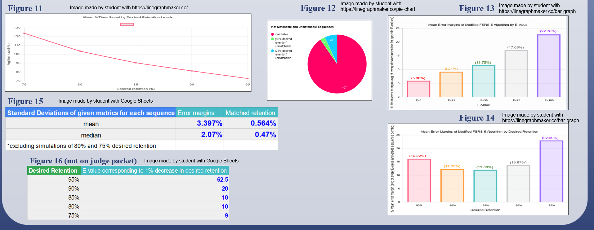
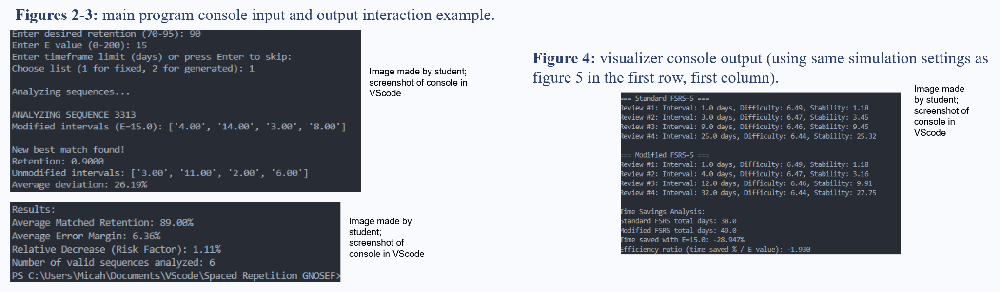
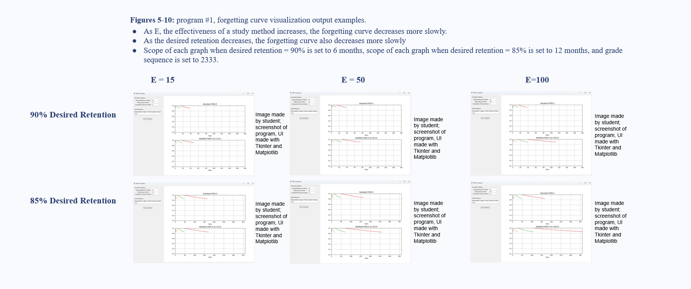

***

# FSRS-Desired-Retention-Adjuster

This was a science fair project I made in 11th grade to investigate Anki's FSRS-5 spaced repetition algorithm. It won 1st place in the Mathematics & Systems Software category at the Greater New Orleans regional competition.

>**Note**: This project is specifically based on FSRS-5. Since then, newer versions of FSRS have made the forgetting curve itself trainable, so parts of this project are no longer as applicable to current versions. However, the question of how a user should choose their desired retention still remains relevant.

## Background and Research Question

Spaced repetition algorithms like FSRS adjust review intervals based on how likely you are to remember a card. One of the settings users can choose is **desired retention**, which is the target probability of recalling a card when it is due.

I was interested in whether improvements in how a person learns or encodes information, which are believed to slow memory decay, could be represented in FSRS-5.

To investigate this, I modified the decay rate in FSRS-5 by introducing an additional parameter, `E`, and then searched for the desired-retention value in the original FSRS-5 algorithm that most closely resembled the modified curve.

In other words, the main question of this project was: **Can a change in the memory decay rate be approximated by simply changing desired retention?**

## How It Works

FSRS-5 uses a forgetting curve to estimate retrievability, or the probability that a card can still be recalled after a certain amount of time.

The relevant part of the FSRS-5 model can be represented as:

$$
R(t,S) = \left(1 + \frac{19}{81}\frac{t}{S}\right)^{-\text{decay}}
$$

where:

* `R` is retrievability
* `t` is the time since the last review
* `S` is memory stability
* `decay` controls how quickly retrievability decreases

I implemented the relevant FSRS-5 equations in Python and added an `E` parameter that reduces the rate of decay:

```python
self.decay = baseDecay * (100 / (100 + E))
```

An `E` value of `0` produces the original FSRS-5 decay rate. Larger `E` values represent a hypothetical improvement in memory retention and therefore produce a slower forgetting curve.

The program then compares the modified FSRS-5 schedule with the original algorithm and searches for the desired-retention value that produces the closest match. The difference between schedules is measured by the percentage deviation between their corresponding review intervals.

## Experimental Setup

I collected data for every combination of:

* **5 desired-retention values:** 75%, 80%, 85%, 90%, and 95%
* **11 E-values:** 0, 5, 10, 15, 25, 50, 75, 100, 125, 150, and 200
* **9 review sequences** representing different possible Anki review histories

This produced **495 experimental conditions**.

The experimental data is available in [`Anki Spreadsheet.xlsx`](Anki%20Spreadsheet.xlsx).

**Grade Sequences Used:**


## Results

My main observations from the experiments were:

1. The percentage of time saved by an `E` value varied depending on the review sequence, but was generally somewhat higher or lower than the value of `E` itself. This difference became larger as desired retention decreased.

2. The similarity between the modified and original FSRS-5 schedules depended on both the `E` value and desired retention. In general, larger `E` values and lower desired-retention values produced greater deviations.

3. The matched desired-retention values and error margins were relatively consistent across different review sequences.

4. Based on the results, I was able to produce rough estimates for converting an `E` value into an equivalent decrease in desired retention.



## Why Does the Deviation Increase?

The FSRS-5 scheduling formula contains a negative exponent involving the decay parameter. As desired retention decreases, the calculated interval becomes more sensitive to changes in the decay rate.

For example, using the simplified form of the scheduling equation:

* With `E = 0`, changing retention from `r = 0.9` to `r = 0.8` produces a relatively small change.
* With `E = 100`, the increased effect of the decay adjustment makes the same change in `r` produce a much larger difference.

This helps explain two of the patterns I observed:

* Larger `E` values caused the schedules to diverge more from the original algorithm.
* The effect of `E` was larger at lower desired-retention values.

## Conclusion

Under the conditions where the two schedules matched most closely, the modified FSRS-5 algorithm could often be approximated by using a lower desired-retention value in the original algorithm.

This suggests that, for FSRS-5, changing the decay rate did not always require modifying the scheduling algorithm itself if a sufficiently close desired-retention value could be found.

However, the conversion was not perfect. Some combinations produced significantly larger errors, particularly with larger `E` values and lower desired-retention values. The approach also depends on estimating an appropriate `E` value, and I did not have a mathematically established way to assign specific `E` values to particular study techniques.

The results therefore suggest a possible relationship between memory decay and desired retention, rather than providing a universal conversion.

## Project Screenshots

### Main Program



### Forgetting Curve Visualizer



The project also includes a separate visualizer that displays the forgetting curves and review intervals produced by the two algorithms.

## Running the Project

### Requirements

* Python 3
* NumPy
* Matplotlib

Install the required packages:

```bash
pip install numpy matplotlib
```

Run the experimenter:

```bash
python main.py
```

Run the visualizer:

```bash
python visualizer.py
```

## References

The sources used for the project's literature review and mathematical implementation are listed in [`References.txt`](references.txt).
